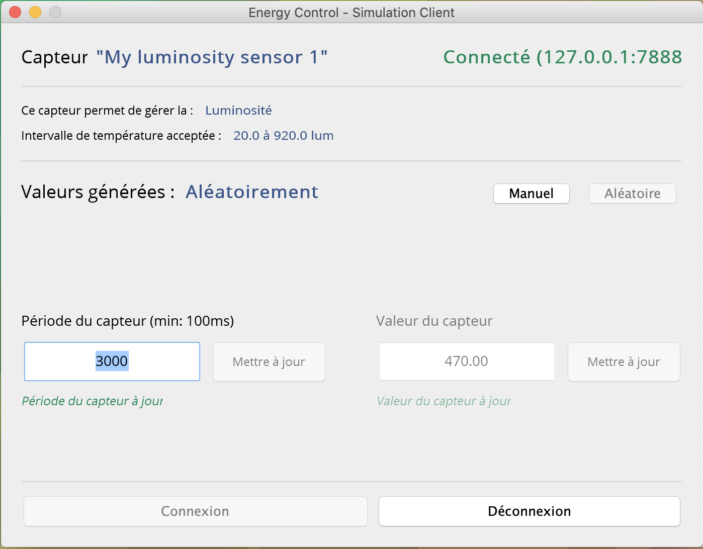
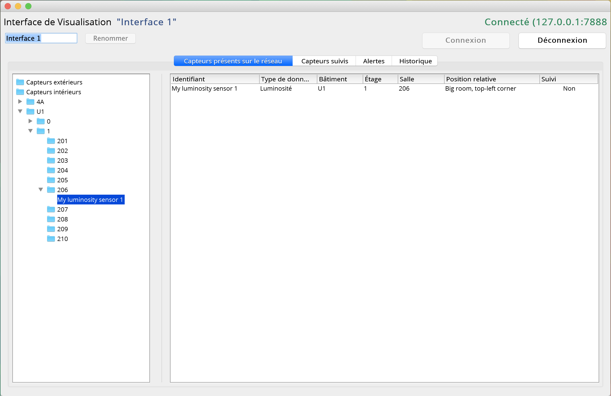
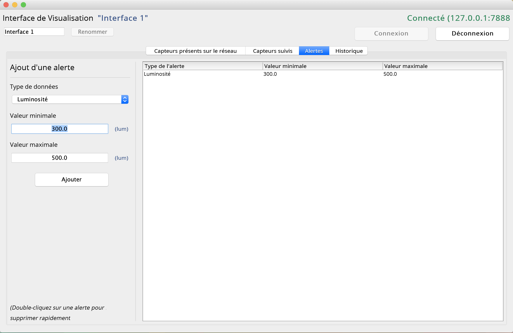
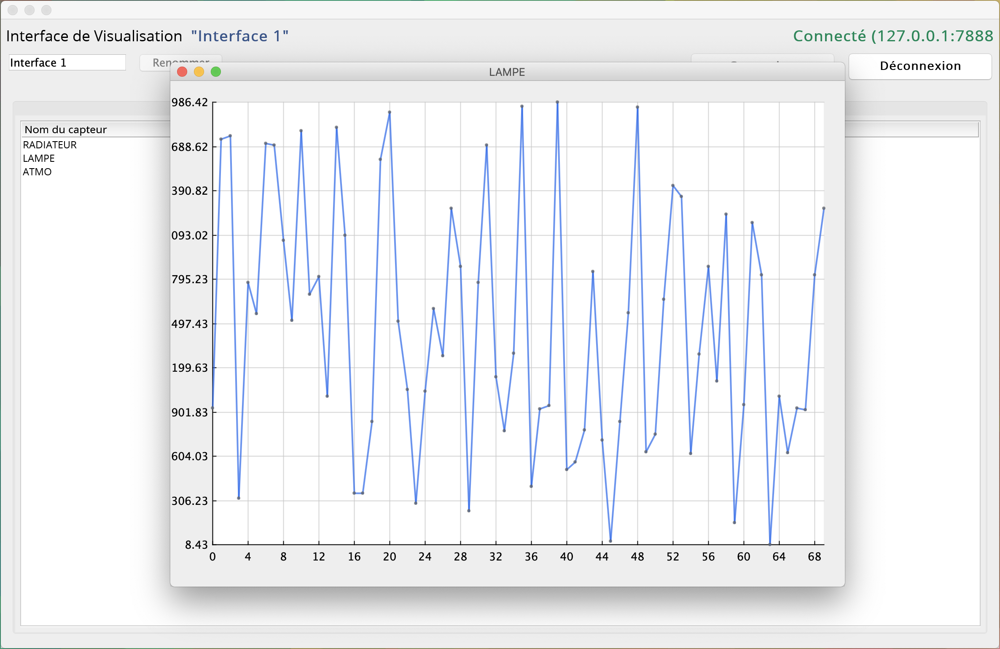

As part of the neOCampus project from [Paul Sabatier University](http://www.univ-tlse3.fr/), I had to realize a software to gather, visualize and interpret real-time datas from different types of sensors located on the University campus.

This software allows to display the values, types, names, location and ranges of eligible values for each sensor. Alerts are created if a sensor's value gets out of the eligible range or if a sensor shows no sign of life.

It is also possible to keep a history of the sensors values as well as to display a graph representing the evolution of these values over the time in real-time.

_Project carried out as part of my third year at [Paul Sabatier Universsity](http://www.univ-tlse3.fr/)._

## Features

###### Server

- Running a SensorNetwork server

###### Sensors

- Adding an interior/exterior sensor to a server
- Rename sensor
- Setting sensor's update time
- Generating sensor's value automatically
- Setting sensor's value manually
- Settings sensor's values range

###### Visualization interfaces

- Adding and connecting a visualization interface to a server
- Rename visualization interface
- Browse the server's sensors sorted by localization
- Tracking a sensor's value
- Setting up alerts on specific sensor's types/values range
- Real-time visualization of sensor's values history

## Screenshots and preview

